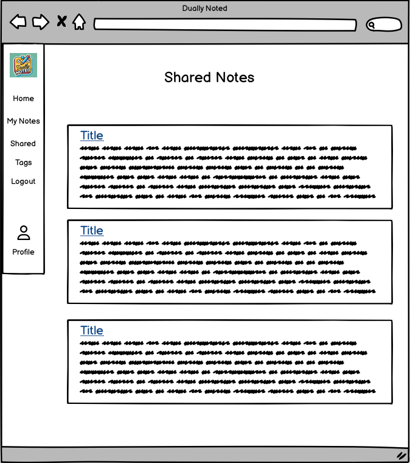
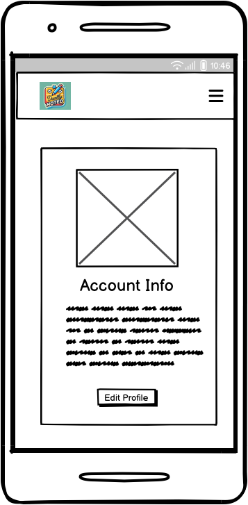
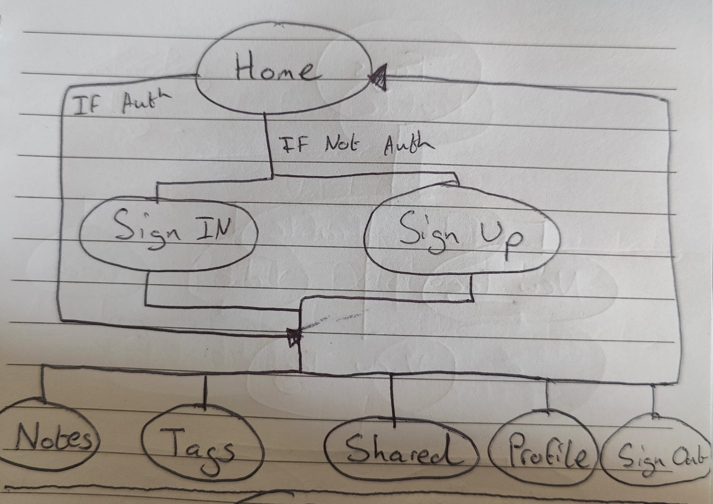

# **_Dually Noted - Project Portfolio 5 - Advanced Front End (React)_**

Dually Noted is an online app for people to create notes and share them with friends, co-workers and family. In its current iteration a User can create their own profile, create and edit their own notes, apply tags to their notes to help with organisation and share their notes with other users.

The live site can be viewed [here](https://dually-noted-react-aeaa107c29f9.herokuapp.com/)

The live API can be viewed [here](https://dually-noted-f734097d9d34.herokuapp.com/)

The front end README.md can be viewed [here](https://github.com/SnappyJumper/dually-noted/blob/main/README.md)

The back end README.md can be viewed [here](https://github.com/SnappyJumper/dually-noted-drf-api/blob/main/README.md)

# Table of Contents

- [**Objective**](#objective)
- [**User Experience UX**](#user-experience-ux)
  - [Project Goals](#project-goals)
  - [User Stories](#user-stories)
  - [Wireframes](#wireframes)
  - [Flow Diagrams](#flow-diagrams)
  - [Design Choices](#design-choices)
  - [Typography](#typography)
  - [Colour Scheme](#colour-scheme)
  - [Project Management](#project-management)
- [**Permissions**](#permissions)
  - [Logged Out User](#logged-out-user)
  - [Logged In User](#logged-in-user)
- [**Existing Features**](#existing-features)
- [**Future Features**](#future-features)
- [**Technologies Used**](#technologies-used)
- [**Testing**](#testing)
- [**Deployment To Heroku**](#deployment-to-heroku)
- [**Credits**](#credits)
  - [**Content**](#content)
  - [**Media**](#media)
- [**Assessor Information**](#assessor-information)
- [**Acknowledgments**](#acknowledgements)

# Objective

For this project I wanted to design a site in which users could create, edit, save and share notes for personal reasons or for work. Users could collaborate on notes and also create their own profiles so other users would know who is sharing with them. This site would demonstrate a proficient understanding of React JS and Djando Rest Framework and adhere to agile methodologies. It would also show a focus on design and provide a positive user experience.

[Back to top](#table-of-contents)

# User Experience (UX)

## Project Goals

- Build a project where users can create, store and share notes
- Ensure the project is responsive and can be viewed across a range of screens and devices
- Design a layout that is both intuitive and provides a positive user experience
- Use a theme that is simple, complimentary and does not distract from the sites purpose
- Allow users to create and login to their own private accounts. Afterwhich they can logout whenever they choose
- Allow users to create, edit and delete tags to organise their notes better
- Allow users to assign read/write permissions to the user they are sharing a note with
- Allow users to be able to remove themselves from a note that has been shared with them
- Allow users to be able to customise their profile pages with a bio or profie picture and add their own name if they wish

## User Stories

- As a user I want to be able to sign up for an account, so that I can use the site 
- As a user I want to be able to create a note, so I can get the full experience of using the site
- As a user I want to be able to edit my notes, so that I can correct/update information on my notes 
- As a user I want to be able to read my notes, so that I can review them later
- As a user I want to be able to delete my notes, so that I can clear space 
- As a user I want to be able to share my notes with another user, so we can collaborate together 
- As a user I want to be able to edit read/write permissions for my notes, so thatI have more control over what users can do with the notes I share with them 
- As a user I would like to be able to remove others and remove myself from a shared note, to add more functuality to sharing notes 
- As a user I would like to be able to create tags, to help organise my notes
- As a user I would like to be able to edit my tags, so I cn change their name if it no longer suits the notes
- As a user I would like to be able to remove a note from a tag, in case the note is no longer relevent to the tag
- As a user I would like to be able to delete a tag, if it no longer serves its purpose
- As a user I would like to be able to view other users profiles, to encourage collaboration
- As a user I would like to be able to edit my profile so that I could add a personal touch to it.

GitHub Projects was used as my project management tool to track my user stories. I created similar stories for both the front end and the backend. I also grouped my projects into milestones to keep them attached to their features.

You can view my GitHub Project kanban board [here](https://github.com/users/SnappyJumper/projects/4/views/1)

[Back to top](#table-of-contents)

## Wireframes

I used [Balsamic](https://balsamiq.com/product/) to generate wireframes for my project to help plan the placement of different elements within the pages.

Page | Desktop | Mobile
--- | --- | ---
Home |  | 
Login |  | 
Sign Up |  | 
My Notes |  | 
Note Detail |  | 
Create/Edit Note |  | 
Shared |  | 
Tags |  | 
Add Tag Popup |  | Same as desktop
Profile |  | 
Edit Profile |  | 
Mobile Navbar Extended | N/A | 

[Back to top](#table-of-contents)

## Flow Diagrams

During the design process I drew my flow diagrams for the site which I have included below.

- Upper Level 
- Notes Level 
- Tags Level 
- Shared Level 
- Profile Level 

## Design Choices

- ### Colour Scheme 