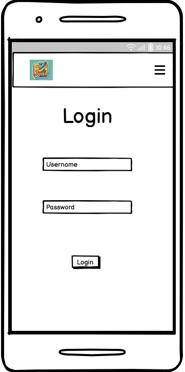

# **_Dually Noted - Project Portfolio 5 - Advanced Front End (React)_**

Dually Noted is an online app for people to create notes and share them with friends, co-workers and family. In its current iteration a User can create their own profile, create and edit their own notes, apply tags to their notes to help with organisation and share their notes with other users.

The live site can be viewed [here](https://dually-noted-react-aeaa107c29f9.herokuapp.com/)

The live API can be viewed [here](https://dually-noted-f734097d9d34.herokuapp.com/)

The front end README.md can be viewed [here](https://github.com/SnappyJumper/dually-noted/blob/main/README.md)

The back end README.md can be viewed [here](https://github.com/SnappyJumper/dually-noted-drf-api/blob/main/README.md)

# Table of Contents

- [**Objective**](#objective)
- [**User Experience UX**](#user-experience-ux)
  - [Project Goals](#project-goals)
  - [User Stories](#user-stories)
  - [Wireframes](#wireframes)
  - [Flow Diagrams](#flow-diagrams)
  - [Design Choices](#design-choices)
  - [Typography](#typography)
  - [Colour Scheme](#colour-scheme)
  - [Project Management](#project-management)
- [**Permissions**](#permissions)
  - [Logged Out User](#logged-out-user)
  - [Logged In User](#logged-in-user)
  - [Shared Note Permissions](#shared-note-permissions)
- [**Existing Features**](#existing-features)
- [**Future Features**](#future-features)
- [**Technologies Used**](#technologies-used)
- [**Testing**](#testing)
- [**Deployment To Heroku**](#deployment-to-heroku)
- [**Credits**](#credits)
  - [**Content**](#content)
  - [**Media**](#media)
- [**Assessor Information**](#assessor-information)
- [**Acknowledgments**](#acknowledgements)

# Objective

For this project I wanted to design a site in which users could create, edit, save and share notes for personal reasons or for work. Users could collaborate on notes and also create their own profiles so other users would know who is sharing with them. This site would demonstrate a proficient understanding of React JS and Djando Rest Framework and adhere to agile methodologies. It would also show a focus on design and provide a positive user experience.

[Back to top](#table-of-contents)

# User Experience (UX)

## Project Goals

- Build a project where users can create, store and share notes
- Ensure the project is responsive and can be viewed across a range of screens and devices
- Design a layout that is both intuitive and provides a positive user experience
- Use a theme that is simple, complimentary and does not distract from the sites purpose
- Allow users to create and login to their own private accounts. Afterwhich they can logout whenever they choose
- Allow users to create, edit and delete tags to organise their notes better
- Allow users to assign read/write permissions to the user they are sharing a note with
- Allow users to be able to remove themselves from a note that has been shared with them
- Allow users to be able to customise their profile pages with a bio or profie picture and add their own name if they wish

## User Stories

- As a user I want to be able to sign up for an account, so that I can use the site 
- As a user I want to be able to create a note, so I can get the full experience of using the site
- As a user I want to be able to edit my notes, so that I can correct/update information on my notes 
- As a user I want to be able to read my notes, so that I can review them later
- As a user I want to be able to delete my notes, so that I can clear space 
- As a user I want to be able to share my notes with another user, so we can collaborate together 
- As a user I want to be able to edit read/write permissions for my notes, so thatI have more control over what users can do with the notes I share with them 
- As a user I would like to be able to remove others and remove myself from a shared note, to add more functuality to sharing notes 
- As a user I would like to be able to create tags, to help organise my notes
- As a user I would like to be able to edit my tags, so I cn change their name if it no longer suits the notes
- As a user I would like to be able to remove a note from a tag, in case the note is no longer relevent to the tag
- As a user I would like to be able to delete a tag, if it no longer serves its purpose
- As a user I would like to be able to view other users profiles, to encourage collaboration
- As a user I would like to be able to edit my profile so that I could add a personal touch to it.

GitHub Projects was used as my project management tool to track my user stories. I created similar stories for both the front end and the backend. I also grouped my projects into milestones to keep them attached to their features.

You can view my GitHub Project kanban board [here](https://github.com/users/SnappyJumper/projects/4/views/1)

[Back to top](#table-of-contents)

## Wireframes

I used [Balsamic](https://balsamiq.com/product/) to generate wireframes for my project to help plan the placement of different elements within the pages.

Page | Desktop | Mobile
--- | --- | ---
Home |  | 
Login |  | 
Sign Up |  | 
My Notes |  | 
Note Detail |  | 
Create/Edit Note |  | 
Shared |  | 
Tags |  | 
Add Tag Popup |  | Same as desktop
Profile |  | 
Edit Profile |  | 
Mobile Navbar Extended | N/A | 

[Back to top](#table-of-contents)

## Flow Diagrams

During the design process I drew my flow diagrams for the site which I have included below.

- Upper Level 
- Notes Level 
- Tags Level 
- Shared Level 
- Profile Level 

## Design Choices

- ### Colour Scheme 

The colour scheme I settled on was an Anti-flash White(#F5F7F9) for the background and all text outside the Navbar a shade of Jet(#2e2e2e). Gunmetal(#2e3440) for the navigation bar and its text a shade of Lavender(#d8dee9). All notes and containers in the project had a Lemon Chiffon(#fff9c4) background and their subtitle text was colored Violet Blue(#2142b2). The various buttons were given different colours depending on their purpose with the more dangerous given a Vermillion(#f44336) and the more accepting buttons a Violet Blue(#2142b2) or just a white with the same boarder.

The site colours were chosen for their neutral feel while I wanted the nav bar to stand out a bit with its darker tone. The buttons were chosen to stand out.

## Project Management

- ### GitHub Project Board

As mentioned earlier in the [User Stories](#user-stories) section I used GitHub Project manager to track my issues/userstories and organise the step by step creation of back end and front end. I also utilised GitHubs milestone feature to organise my user stories into various Epics.

You can view my kanban [here](https://github.com/users/SnappyJumper/projects/4/views/1)

## Permissions

Permissions had to be added for protection of private data, so that unauthorised access could not be obtained.

### Logged Out User

A User who is logged out has very little access to the site and can only see:

- Home Page
- Login Page
- Signup Page

### Logged In User

A User who is logged in has all the access the logged out user does plus the following:

- My Notes
  - View Note
  - Create Note
  - Edit Note 
  - Delete Note
  - Assign Tag
  - Share Note
- Tags
  - View Tag
    - View Notes associated with Tag
  - Create Tag
  - Delete Tag
  - Edit Tag
  - Unassign Tag
- Shared
  - View Shared Note
  - View the User's Profile who Shared Note belongs to
  - Edit Note(depending on permision)
  - Delete Note(depending on permission)
  - Remove Themselves from a Shared Note
- Sign Out
- Profile
  - View their profile
  - Edit their profile

### Shared Note Permissions

When creating a note a user can choose to share it with another user. If they do they choose what level of permissions the other user has:

- Read - A Read permission gives the user who the Note has been shared with Read Only access, they can't edit or delete the Note but they can still remove themselves from being a shared User.
- Edit - An Edit permission allows the shared user full access to edit and delete the note should they wish and like the Read access the user can remove themselves from the Shared Note.

## Existing Features

- ### Friendly Home Page

The site has a friendly home page which welcomes users old and new to the site. It was constructed with simplicity in mind and styled to suit the relaxed tone of the site. It also provides a brief, friendly description of the site and provides a link to the login page.

- ### Responsive NavBar

The Navigation bar was designed to be responsive and intuitive to use. It is a side navbar that displays on the left side of the screen and follows the user as they scroll.  It displays our logo and has various navigational options diplayed depending on the users auth status. When it is displayed on a smaller screen the Nav bar mves to the top of the screen and hides its navigational options behind a "burger bar" button. Clicking the button displays the options which again are based on the users auth status.

A logged out user will see:

- Home
- Login 
- Sign up

A logged in user will see:

- Home
- My Notes
- Tags
- Shared
- Log Out
- Profile(Username)

The profile option also has a picture of the current logged in users profile photo.

- Desktop Navbar(Signed Out):   
- Desktop Navbar(Logged in):   
- Mobile Navbar(Collapsed):   
- Mobile Navbar(Extended):   

### My Notes Page

The My notes page displays all the Notes the user has created and shared with other users. From here they can:

- Navigate to the Create Note page
- Navigate to a more detailed view of a note by pressing its title
- Navigate to the Edit Note page to edit an individual note
- Select a note for deletion

If the user selects a Note for deletion they get a pop message which confirms their decision and upon confirmation informs the user that the note has been deleted successfully or unsuccessfully.

- My Notes Page:   
- Deletion Prompt:   
- Successful Deletion Message:   

### Create Note/Edit Note Page

The Create and Edit Note pages are very similar. From these pages a user can:

- Create/update a note which will be stored in the My Notes page
- Fill in the details in the form to create new or update exixting content within the note
- Select a Tag from the drop down list by typing its name or quickly make a new one by pressing create new once they've typed out the new name
- Select another user to share the note with from the dropdown list and assign them read/write permissions too
- Once the user is finished they click save

- Create Note Page:   
- Select or Create A Tag:   
- Select A User to Share:   

### Note Detail Page

The Note Detail page shows a selected Note in more detail. From here a user can:

- Read the Details of a Note including its title, name and associated tags
- Can navigate to the edit page for this note
- Can delete the Note

Upon attempted deletion the user will meet the note deletion propt again and will recieve a message with the status of the action once executed.

- Note Detail Page:   

### Tags Page

The Tags Page displays all the tags that have been created. From here a user can:

- Create a Tag by clicking on the New Tag button.
- Navigate to a Tag by clicking its name.
- Edit a Tag by clicking edit next to the tag name.
- Delete a Tag by clicking delete next to the tags name.

When a user creates a Tag a simple message pops up asking for the tag name. Once that is confirmed the user is given confirmation and the new tag is created.

Similar to the delete button in My Notes the user will be prompted before they delete a note and upon deletion will be notified accordingly.

The edit button is more simple than Notes. It changes the name of the tag to a test entry field where you can just type in the new name and save. You recieve a confirmation message after saving too.

- Tags Page:   
- Create Tag Popup:   
- Tag Edit:   
- Tag Delete Prompt:   

### Tag Detail Page

When the user clicks into a Tag they come to the Tag detail page. From here they can:

- View all the notes that are tagged with this tag
- Remove a Note from a tag

When a user removes a Note from a tag they are prompted with a message to confirm this action upon completion the action is confirmed in a message.

- Tag Detail Page:   
- Tag Removal Prompt:   

### Shared Page

The Shared page displays all the Notes that have been shared with the user. From Here the user can:

- Navigate to a more detailed view of a note by pressing the view button.
- Navigate to a view of the note owners profile page by clicking on their name.

- Shared Page:   

### Shared Note Detail Page

The Shared Note Detail Page allows the user to see the notes they have been shared in more detail. From here a user can:

- Navigate to the Edit Shared Note Page
- Remove themselves from the Shared Note
- Navigate to the profile view of the user who is sharing the Note

When the user uses the remove me from this note button they are greeted by a prompt to confirm their action and then a message upon completion confirming the action.

- Shared Note Detail Page:   
- Remove Me Prompt:   

### Edit Shared Note Page

The Edit Shared Notes Page is a smaller version of our Edit Note page. From here a user can:

- Edit the title and contents of a note that has been shared with them
- However they cannot change tags or assign new shared users.

- [Edit Shared Note Page](src/assets/documentation/screenshots/edit_shared_note_page.png)

### Profile Page

The Profile page allows a user to view their profile details. From here they can:

- View their existing profile details
- Navigate to the Edit Profile Page

- Profile Page:   

### Edit Profile Page

The Edit profile page allows the user to customise or add extra data to their profile page. They can:

- Change their name and bio
- Update their profile photo

- Edit Profile Page:   

### Other User Profile Page

Navigating to the Other Users Profile page from a shared note gives you a look at the other users information.

- Other Users Profile Page:   

### Sign Up Page

the Sign Up page allows users to sign on to the site. From here a user can:

- Enter their details to sign up

Users will recieve confirmation of a successful signup and will also be notified if information they enter is not acceptable.

- Sign Up Page:   
- Sign Up Error:   

### Login Page

The login page is where registered users can log into their accounts:

- Enter your details to be granted access to the sight

Incorrect details will display an error message.

- Login Page:   
- Login Error:   

### Log Out Page

The Log Out page simply prompts the user to make sure they want to logout, if so, logs them out and redirects them to the Sign In Page

- Log Out Page:   
- Log Out Success:   

### 404 Page

The 404 Page comes up when the domain entered is invalid. From here a user can:

- Navigate safely back to the Home page

- 404 Page:   

