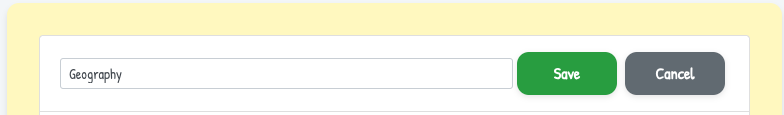
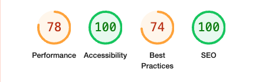

# **_Dually Noted - Project Portfolio 5 - Advanced Front End (React)_**

Dually Noted is an online app for people to create notes and share them with friends, co-workers and family. In its current iteration a User can create their own profile, create and edit their own notes, apply tags to their notes to help with organisation and share their notes with other users.

The live site can be viewed [here](https://dually-noted-react-aeaa107c29f9.herokuapp.com/)

The live API can be viewed [here](https://dually-noted-f734097d9d34.herokuapp.com/)

The front end README.md can be viewed [here](https://github.com/SnappyJumper/dually-noted/blob/main/README.md)

The back end README.md can be viewed [here](https://github.com/SnappyJumper/dually-noted-drf-api/blob/main/README.md)


# Table of Contents

- [**Objective**](#objective)
- [**User Experience UX**](#user-experience-ux)
  - [Project Goals](#project-goals)
  - [User Stories](#user-stories)
  - [Wireframes](#wireframes)
  - [Flow Diagrams](#flow-diagrams)
  - [Design Choices](#design-choices)
  - [Typography](#typography)
  - [Colour Scheme](#colour-scheme)
  - [Project Management](#project-management)
- [**Permissions**](#permissions)
  - [Logged Out User](#logged-out-user)
  - [Logged In User](#logged-in-user)
  - [Shared Note Permissions](#shared-note-permissions)
- [**Existing Features**](#existing-features)
  - [Friendly Home Page](#friendly-home-page)
  - [Responsive NavBar](#responsive-navbar)
  - [My Notes Page](#my-notes-page)
  - [Create Note/Edit Note Page](#create-noteedit-note-page)
  - [Note Detail Page](#note-detail-page)
  - [Tags Page](#tags-page)
  - [Tag Detail Page](#tag-detail-page)
  - [Shared Page](#shared-page)
  - [Shared Note Detail Page](#shared-note-detail-page)
  - [Edit Shared Note Page](#edit-shared-note-page)
  - [Profile Page](#profile-page)
  - [Edit Profile Page](#edit-profile-page)
  - [Other User Profile Page](#other-user-profile-page)
  - [Sign Up Page](#sign-up-page)
  - [Login Page](#login-page)
  - [404 Page](#404-page)
- [**Future Features**](#future-features)
- [**Technologies Used**](#technologies-used)
- [**Testing**](#testing)
- [**Deployment To Heroku**](#deployment-to-heroku)
- [**Credits**](#credits)
  - [**Content**](#content)
  - [**Media**](#media)
- [**Assessor Information**](#assessor-information)
- [**Acknowledgments**](#acknowledgements)

# Objective

For this project I wanted to design a site in which users could create, edit, save and share notes for personal reasons or for work. Users could collaborate on notes and also create their own profiles so other users would know who is sharing with them. This site would demonstrate a proficient understanding of React JS and Djando Rest Framework and adhere to agile methodologies. It would also show a focus on design and provide a positive user experience.

[Back to top](#table-of-contents)

# User Experience (UX)

## Project Goals

- Build a project where users can create, store and share notes
- Ensure the project is responsive and can be viewed across a range of screens and devices
- Design a layout that is both intuitive and provides a positive user experience
- Use a theme that is simple, complimentary and does not distract from the sites purpose
- Allow users to create and login to their own private accounts. Afterwhich they can logout whenever they choose
- Allow users to create, edit and delete tags to organise their notes better
- Allow users to assign read/write permissions to the user they are sharing a note with
- Allow users to be able to remove themselves from a note that has been shared with them
- Allow users to be able to customise their profile pages with a bio or profie picture and add their own name if they wish

## User Stories

- As a user I want to be able to sign up for an account, so that I can use the site 
- As a user I want to be able to create a note, so I can get the full experience of using the site
- As a user I want to be able to edit my notes, so that I can correct/update information on my notes 
- As a user I want to be able to read my notes, so that I can review them later
- As a user I want to be able to delete my notes, so that I can clear space 
- As a user I want to be able to share my notes with another user, so we can collaborate together 
- As a user I want to be able to edit read/write permissions for my notes, so thatI have more control over what users can do with the notes I share with them 
- As a user I would like to be able to remove others and remove myself from a shared note, to add more functuality to sharing notes 
- As a user I would like to be able to create tags, to help organise my notes
- As a user I would like to be able to edit my tags, so I cn change their name if it no longer suits the notes
- As a user I would like to be able to remove a note from a tag, in case the note is no longer relevent to the tag
- As a user I would like to be able to delete a tag, if it no longer serves its purpose
- As a user I would like to be able to view other users profiles, to encourage collaboration
- As a user I would like to be able to edit my profile so that I could add a personal touch to it.

GitHub Projects was used as my project management tool to track my user stories. I created similar stories for both the front end and the backend. I also grouped my projects into milestones to keep them attached to their features.

You can view my GitHub Project kanban board [here](https://github.com/users/SnappyJumper/projects/4/views/1)


[Back to top](#table-of-contents)

## Wireframes

I used [Balsamic](https://balsamiq.com/product/) to generate wireframes for my project to help plan the placement of different elements within the pages.

Page | Desktop | Mobile
--- | --- | ---
Home |  | 
Login |  | 
Sign Up |  | 
My Notes |  | 
Note Detail |  | 
Create/Edit Note |  | 
Shared |  | 
Tags |  | 
Add Tag Popup |  | Same as desktop
Profile |  | 
Edit Profile |  | 
Mobile Navbar Extended | N/A | 

[Back to top](#table-of-contents)

## Flow Diagrams

During the design process I drew my flow diagrams for the site which I have included below.

- Upper Level 
- Notes Level 
- Tags Level 
- Shared Level 
- Profile Level 

## Design Choices

- ### Typography

For the Main site I used two fonts from [Google Fonts](https://fonts.google.com/):

- [Rubik](https://fonts.google.com/specimen/Rubik) - For the main text throughout the site
- [Patrick Hand](https://fonts.google.com/specimen/Patrick+Hand) - For the note related content

I chose these fonts for Rubiks easy to read structure and Patrick Hand because I felt it suites the tone of the site. 

- ### Colour Scheme 

The colour scheme I settled on was an Anti-flash White(#F5F7F9) for the background and all text outside the Navbar a shade of Jet(#2e2e2e). Gunmetal(#2e3440) for the navigation bar and its text a shade of Lavender(#d8dee9). All notes and containers in the project had a Lemon Chiffon(#fff9c4) background and their subtitle text was colored Violet Blue(#2142b2). The various buttons were given different colours depending on their purpose with the more dangerous given a Vermillion(#f44336) and the more accepting buttons a Violet Blue(#2142b2) or just a white with the same boarder.

The site colours were chosen for their neutral feel while I wanted the nav bar to stand out a bit with its darker tone. The buttons were chosen to stand out.


## Project Management

- ### GitHub Project Board

As mentioned earlier in the [User Stories](#user-stories) section I used GitHub Project manager to track my issues/userstories and organise the step by step creation of back end and front end. I also utilised GitHubs milestone feature to organise my user stories into various Epics.

You can view my kanban [here](https://github.com/users/SnappyJumper/projects/4/views/1)

# Permissions

Permissions had to be added for protection of private data, so that unauthorised access could not be obtained.

### Logged Out User

A User who is logged out has very little access to the site and can only see:

- Home Page
- Login Page
- Signup Page

### Logged In User

A User who is logged in has all the access the logged out user does plus the following:

- My Notes
  - View Note
  - Create Note
  - Edit Note 
  - Delete Note
  - Assign Tag
  - Share Note
- Tags
  - View Tag
    - View Notes associated with Tag
  - Create Tag
  - Delete Tag
  - Edit Tag
  - Unassign Tag
- Shared
  - View Shared Note
  - View the User's Profile who Shared Note belongs to
  - Edit Note(depending on permision)
  - Delete Note(depending on permission)
  - Remove Themselves from a Shared Note
- Sign Out
- Profile
  - View their profile
  - Edit their profile

### Shared Note Permissions

When creating a note a user can choose to share it with another user. If they do they choose what level of permissions the other user has:

- Read - A Read permission gives the user who the Note has been shared with Read Only access, they can't edit or delete the Note but they can still remove themselves from being a shared User.
- Edit - An Edit permission allows the shared user full access to edit and delete the note should they wish and like the Read access the user can remove themselves from the Shared Note.

# Existing Features

- ### Friendly Home Page

The site has a friendly home page which welcomes users old and new to the site. It was constructed with simplicity in mind and styled to suit the relaxed tone of the site. It also provides a brief, friendly description of the site and provides a link to the login page.


- ### Responsive NavBar

The Navigation bar was designed to be responsive and intuitive to use. It is a side navbar that displays on the left side of the screen and follows the user as they scroll.  It displays our logo and has various navigational options diplayed depending on the users auth status. When it is displayed on a smaller screen the Nav bar mves to the top of the screen and hides its navigational options behind a "burger bar" button. Clicking the button displays the options which again are based on the users auth status.

A logged out user will see:

- Home
- Login 
- Sign up

A logged in user will see:

- Home
- My Notes
- Tags
- Shared
- Log Out
- Profile(Username)

The profile option also has a picture of the current logged in users profile photo.

- Desktop Navbar(Signed Out): <br> 
- Desktop Navbar(Logged in): <br> 
- Mobile Navbar(Collapsed): <br> 
- Mobile Navbar(Extended): <br> 

### My Notes Page

The My notes page displays all the Notes the user has created and shared with other users. From here they can:

- Navigate to the Create Note page
- Navigate to a more detailed view of a note by pressing its title
- Navigate to the Edit Note page to edit an individual note
- Select a note for deletion

If the user selects a Note for deletion they get a pop message which confirms their decision and upon confirmation informs the user that the note has been deleted successfully or unsuccessfully.

- My Notes Page: <br> 
- Deletion Prompt: <br> 
- Successful Deletion Message: <br> 

### Create Note/Edit Note Page

The Create and Edit Note pages are very similar. From these pages a user can:

- Create/update a note which will be stored in the My Notes page
- Fill in the details in the form to create new or update exixting content within the note
- Select a Tag from the drop down list by typing its name or quickly make a new one by pressing create new once they've typed out the new name
- Select another user to share the note with from the dropdown list and assign them read/write permissions too
- Once the user is finished they click save

- Create Note Page: <br> 
- Select or Create A Tag: <br> 
- Select A User to Share: <br> 

### Note Detail Page

The Note Detail page shows a selected Note in more detail. From here a user can:

- Read the Details of a Note including its title, name and associated tags
- Can navigate to the edit page for this note
- Can delete the Note

Upon attempted deletion the user will meet the note deletion propt again and will recieve a message with the status of the action once executed.

- Note Detail Page: <br> 

### Tags Page

The Tags Page displays all the tags that have been created. From here a user can:

- Create a Tag by clicking on the New Tag button.
- Navigate to a Tag by clicking its name.
- Edit a Tag by clicking edit next to the tag name.
- Delete a Tag by clicking delete next to the tags name.

When a user creates a Tag a simple message pops up asking for the tag name. Once that is confirmed the user is given confirmation and the new tag is created.

Similar to the delete button in My Notes the user will be prompted before they delete a note and upon deletion will be notified accordingly.

The edit button is more simple than Notes. It changes the name of the tag to a test entry field where you can just type in the new name and save. You recieve a confirmation message after saving too.

- Tags Page: <br> 
- Create Tag Popup: <br> 
- Tag Edit: <br> 
- Tag Delete Prompt: <br> 

### Tag Detail Page

When the user clicks into a Tag they come to the Tag detail page. From here they can:

- View all the notes that are tagged with this tag
- Remove a Note from a tag

When a user removes a Note from a tag they are prompted with a message to confirm this action upon completion the action is confirmed in a message.

- Tag Detail Page: <br> 
- Tag Removal Prompt: <br> 

### Shared Page

The Shared page displays all the Notes that have been shared with the user. From Here the user can:

- Navigate to a more detailed view of a note by pressing the view button.
- Navigate to a view of the note owners profile page by clicking on their name.

- Shared Page: <br> 

### Shared Note Detail Page

The Shared Note Detail Page allows the user to see the notes they have been shared in more detail. From here a user can:

- Navigate to the Edit Shared Note Page
- Remove themselves from the Shared Note
- Navigate to the profile view of the user who is sharing the Note

When the user uses the remove me from this note button they are greeted by a prompt to confirm their action and then a message upon completion confirming the action.

- Shared Note Detail Page: <br> 
- Remove Me Prompt: <br> 

### Edit Shared Note Page

The Edit Shared Notes Page is a smaller version of our Edit Note page. From here a user can:

- Edit the title and contents of a note that has been shared with them
- However they cannot change tags or assign new shared users.

- [Edit Shared Note Page](src/assets/documentation/screenshots/edit_shared_note_page.png)

### Profile Page

The Profile page allows a user to view their profile details. From here they can:

- View their existing profile details
- Navigate to the Edit Profile Page

- Profile Page: <br> 

### Edit Profile Page

The Edit profile page allows the user to customise or add extra data to their profile page. They can:

- Change their name and bio
- Update their profile photo

- Edit Profile Page: <br> 

### Other User Profile Page

Navigating to the Other Users Profile page from a shared note gives you a look at the other users information.

- Other Users Profile Page: <br> 

### Sign Up Page

the Sign Up page allows users to sign on to the site. From here a user can:

- Enter their details to sign up

Users will recieve confirmation of a successful signup and will also be notified if information they enter is not acceptable.

- Sign Up Page: <br> 
- Sign Up Error: <br> 

### Login Page

The login page is where registered users can log into their accounts:

- Enter your details to be granted access to the sight

Incorrect details will display an error message.

- Login Page: <br> 
- Login Error: <br> 

### Log Out Page

The Log Out page simply prompts the user to make sure they want to logout, if so, logs them out and redirects them to the Sign In Page

- Log Out Page: <br> 
- Log Out Success: <br> 

### 404 Page

The 404 Page comes up when the domain entered is invalid. From here a user can:

- Navigate safely back to the Home page

- 404 Page: <br> 

[Back to top](#table-of-contents)

# Future Features

In the future I would like to incorporate the following:

- A search bar for easy note navigation
- Introducing Rich Text to notes utilising [Summernote](https://summernote.org/) or something similar
- Allowing Users to share with more than one user at a time
- Adding comments to notes to improve collaboration

# Technologies Used

## Languages

- [JavaScript](https://www.javascript.com/) - A web development programming language
- [HTML5](https://en.wikipedia.org/wiki/HTML5) - A markup language used to structure web pages
- [CSS3](https://en.wikipedia.org/wiki/CSS) - A style sheet language used to add styles to the web pages

## Libraries and Frameworks

- [React](https://reactjs.org/) - Front end JavaScript library for creating advanced user interfaces
- [Bootstrap](https://getbootstrap.com/) - CSS Framework for the development of responsive websites
- [Google Fonts](https://fonts.google.com/) - A library of fonts for use in website design

## NPM Packages / Dependancies

- [axios](https://www.npmjs.com/package/axios) - Promise-based HTTP client for making API requests in the browser or Node.js
- [jwt-decode](https://jwt.io/) - Decodes JSON Web Tokens (JWT) without verifying the signature
- [react-bootstrap](https://react-bootstrap.github.io/) - React components built using Bootstrap for responsive UI
- [react-dom](https://reactjs.org/docs/react-dom.html) - Provides DOM-specific methods for React apps (e.g., rendering to the DOM)
- [react-infinite-scroll-component](https://www.npmjs.com/package/react-infinite-scroll-component) -  Enables infinite scrolling behavior in React apps
- [react-router-dom](https://www.npmjs.com/package/react-router-dom) - Declarative routing for React web applications
- [react-scripts](https://www.npmjs.com/package/react-scripts) - Scripts and configuration used by Create React App
- [react-select](https://react-select.com/home) - A flexible and customizable dropdown/select component for React
- [web-vitals](https://web.dev/vitals/) - Measures essential performance metrics for web apps (like Core Web Vitals)

## Other Tools

- [Favicon](https://favicon.io/) - To generate favicon
- [VSCode](https://code.visualstudio.com/) - To create and edit the site
- [GitHub](https://github.com/) - To hodt and deploy my repositorys
- [GitBash](<https://en.wikipedia.org/wiki/Bash_(Unix_shell)>) - terminal used for pushing changes to GitHub
- [Google Chrome DevTools](https://developer.chrome.com/docs/devtools/) - Used to debug and ctest page responsiveness
- [Balsamic](https://balsamiq.com/) - sed to generate wireframes
- [Heroku](https://dashboard.heroku.com) - Used for deploying the repository
- [eslint](https://eslint.org/) - Used for validation
- [Chat GPT](https://openai.com/chatgpt/overview/) - AI used to assist with questions, code commenting and debugging
- [Stack Overflow](https://stackoverflow.com/questions) - Used to ask questions and debugging

[Back to top](#table-of-contents)

# Testing

- ## Code Validation

I used eslint for JavaScript code validation

- ## Lighthoue testing

Happy with lighthouse testing for the moment will work on best practices results in future

- Home: <br> 
- My Notes: <br> 
- Tags: <br> 
- Shared: <br> 
- Profile: <br> 
- Edit Note: <br> 
- Create Note: <br> 
- Shared Note Detail: <br> 
- Log In: <br> 
- Sign Up: <br> 
- Edit Profile: <br> 
- Log Out: <br> 
- Other Profile: <br> 

- ## Responsiveness Testing

Ive tested the site out on a few devices.

Device | Pass/Fail
--- | ---
iPhone SE | Pass
OnePlus 10T | Pass
Samsung Galaxy S8 | Pass
IPad Mini | Pass
Mac Book Pro 13inch | Pass
Acer Aspire | Pass 

- ## Manual Testing 

| Page/Feature | Action | Expected Result | Pass/Fail |
| --- | ------ | ---------- | --------- |
| Home | Clicked on Get Started Button | Navigates to Sign Up Page | Pass |
| Sign Up | Signed Up with correct details | Success, logs in and directs to My Notes | Pass |
| Sign Up | Password too short | Rejection warning, note with reason | Pass |
| Sign Up | Passwords don't match | Rejection warning, note with reason | Pass|
| Sign Up | Leaving blank fields | Rejection warning, note with reason | Pass |
| Sign Up | Clicking on "Already have acc..." link | Redirects you to log in | Pass |
| Log In  | Correct credentials | Success, logs in and directs to My Notes | Pass |
| Log in  | In-correct credentails | Rejection warning, note with reason | Pass |
| Log in  | Blank Fields | Rejection, note with reason| Pass |
| Log In  | Clicking on "Dont have an acc..." link | Redirects you to Sign Up | Pass |
| Log Out | Clicking on "Yes, log me out" | Logs out the user and, redirects to Log In | Pass
| Log Out | Clicking on "Cancel" button | Doesn't log user out and redirects to My Notes Instead | Pass
| My Notes | Clicking on "+ Add Note" button | Brings user to the Create Note Page | Pass
| My Notes | Clicking on the title of a Note | Brings user to the Detailed Note Page | Pass 
| My Notes | Clicking on the "Edit" button on a Note | Brings user to the Edit Note Page with the form prefilled with the Notes data | Pass |
| My Notes | Clicking "Delete" Button on a Note | Brings up a pop up confirming request to delete | Pass |
| My Notes | Clicking the "Delete" button on the deletion confirmation pop up | Deletes the Note with a confirmation | Pass |
| My Notes | Clicking the "Cancel" button on the deletion confirmation pop up | Aborts deletion and closes the pop up | Pass |
| Create/Edit Note | Filling out or editing the title and content fields but leaving tags, shared and permission unselected | Success, note to confirm addition and redirected to My Notes | Pass |
| Create/Edit Notes | Leaving Title or Contents blank and trying to submit the form | Failure, prompted to fill in blank fields | Pass |
| Create/Edit Notes | Fill in a tag name that exists in the data base and adding | On submit tag will be assigned | Pass |
| Create/Edit Notes | Fill in a tag nme that does not exist but not selecting "Create" option | Tag will dissapear as soon as you click out | Pass |
| Create/Edit Notes | Fill in a tag name that does not exist but clicking the "Create" option | Tag is created in database and assigned to the Note on submit | Pass |
| Create/Edit Notes | Selecting a name from the Share with user dropdown and submitting the form | Form submits and Note now appears in the users My notes and the shared with users Shared | Pass |
| Create/Edit | Leaving the Permissions dropdown untouched after selecting a user to share with | Defaults to Read Permission on submit | Pass |
| Create/Edit | Trying to select permission before selecting a user | Can't do as greyed out | Pass |
| Create/Edit | Clicking the "Cancel button" | Abandons the creation/Edit and redirects user to My Notes | Pass |
| Note Detail | Clicking on "Edit" button | Redirects user to Edit Note page with the content prefilled | Pass |
| Note Detail | Clicking on "Delete" button | Brings up a prompt asking does the user wish to continue | Pass |
| Note Detail | Clicking on the "Delete" option in the deletion confirmation pop up | Successful deletion and confirmation | Pass |
| Note Detail | Clicking on "Cancel" option in the deletion confirmation pop up | Deletion is aborted | Pass |
| Tags | Clicking on "+ New Tag" button | displays the new tag pop up window | Pass |
| Tags | Clicking on "Create" button on new tag pop up window without filling in a name | rejection warning and prompted to fill in field, No tag created | Pass
| Tags | Entering a Tag name and clicking "Create" | Tag created with name that was added | Pass |
| Tags | Clicking "Cancel" button on new tag pop up window | Abandons tag creation and closes pop up | Pass |
| Tags | Clicking into a Tags name | Directs User to the tags detail page | Pass |
| Tags | Clicking the "Edit" button in a Tag | replaces the Tags name with a form field where the tags name can be edited | Pass |
| Tags | Leaving the tags name empty in the edit tag field and saving | Rejected request, tag name can't be blank | Pass |
| Tags | Entering a new name into the tag edit field and saving | Tag name is changed | Pass |
| Tags | Pressing the "Cancel" button in the tag edit field | Tag editing abandoned and no changes are made | Pass |
| Tags | Clicking the "Delete" button in a tag | Brings up the tag deletion pop up confirmation | Pass |
| Tags | Clicking the "Delete" option on the tag deletion pop up confirmation | Deletes Tag with a confirmation message | Pass |
| Tags | Clicking the "Cancel" option on the tag deletion pop up confirmation | Abandons the deletion and closes the pop up | Pass |
| Tag Detail | Clicking on the "Remove from Tag" button | Brings up the remove tag pop up confirmation | Pass |
| Tag Detail | Clicking on the "Remove Tag" button in the remove tag pop up confirmation | Removes the note from the tag and it dissapears from the tag detail | Pass |
| Tag Detail | Clicking "Cancel" button on the remove tag pop up confirmation | Abandons tag removal and closes the cinfirmation pop up | Pass |
| Tag Detail | Clicking on the title of a note | Redirects the user to the note detail page of that particular note | Pass |
| Shared Notes | Clicking on the title or the "View" button of a shared note | Opens up the detail page for that shared note | Pass |
| Shared Notes | Clicking on the username of the owner of the shared note | Directs the user to a read only display of that users profile | Pass |
| Shared Note Detail | Clicking on the username of the owner of the shared note | Directs user to a read only display of that users profile | Pass |
| Shared Note Detail | Clicking on the "Edit" button (When user has edit permissions) | User is redirected to Edit Shared Note page | Pass |
| Shared Note Detail | Clicking on "Remove Me From This Note Button" | The leave shared note pop up confirmation appears | Pass |
| Shared Note Detail | Clicking on the "Remove Me" option in the leave shared note pop up confirmation | User is removed from shared note and action is confirmed | Pass |
| Shared Note Detail | Clicking on the "Cancel" button in the leave shared note pop up confirmation | Abandons the leaving of the shared note and closes the popup | Pass |
| Shared Note Edit | Empty the form fields and try to submit | Fail to submit, prompted to fill fields | Pass |
| Shared Note Edit | Edit the form correctly and submit | Shared note is updated and user is informed of the change | Pass |
| Shared Note Edit | Clicking on "Remove Me From This Note Button" | The leave shared note pop up confirmation appears | Pass |
| Shared Note Edit | Clicking on the "Remove Me" option in the leave shared note pop up confirmation | User is removed from shared note and action is confirmed | Pass |
| Shared Note Edit | Clicking on the "Cancel" button in the leave shared note pop up confirmation | Abandons the leaving of the shared note and closes the popup | Pass |
| My Profile | Clicking on the "Edit Profile" button | Redirects user to the edit profile page | Pass |
| Edit Profile | Clicking on the "Choose File" button | Opens up a pop up where the usercan select a photo | Pass |
| Edit Profile | When photo is selected and "Open button is pressed" | New photo is uploaded | Pass |
| Edit Profile | The Name or Bio fields are left blank on submission | Submission accepted, having these fields filled out is a user preference | Pass |
| Edit Profile | Editing the contents of the form and saving | Successful edit and confirmation is given the profile updates with whatever image, name or bio you edited | Pass |
| Edit Profile | Clicking the "Cancel button" | Abandons the edit and bring user back to the profile page | Pass |
| Nav Bar | Clicking on the "Home" link | Directs the user to the Home page | Pass |
| Nav Bar | Clicking on the "My Notes" link | Directs the user to My Notes page | Pass |
| Nav Bar | Clicking on the "Tags" link | Directs the user to the Tags page | Pass |
| Nav Bar | Clicking on the "Shared" link | Directs the user to the Shared page | Pass |
| Nav Bar | Clicking on the "Log Out" link | Directs the user to the Shared page | Pass |
| Nav Bar | Clicking on the "Sign Up" link | Directs the user to the Sign Up page | Pass |
| Nav Bar | Clicking on the "Log In" link | Directs the user to the Log In page | Pass |
| Nav Bar | Clicking on the users name at the bottom of the Nav Bar | Directs the user to their Profile page | Pass |
| Nav Bar | When user is not authenticated | The only navlinks available are "Home", "Sign In" and "Sign Up" | Pass |
| Nav Bar | When user is authenticated | The Navlinks "Home", "My Notes", "Tags", "Shared", "Log Out" and "Profile" are available | Pass |
| 404 Page | When a user enters an invalid domain | The 404 Page displays | Pass |
| 404 Page | When a user clicks the "Back to Safety" button | The user is directed back to the Home page | Pass |

- ## Browser Compatibility

- The above tests were completed using the following browsers:
  - Google Chrome
  - Firefox
  - Safari
  - Microsoft Edge

[Back to top](#table-of-contents)

- ## Bugs Fixed

 ### Issue with users being unable to remove to remove themselves from a Shared Note if they only have Read Permission

  - During development I came across a bug that wouldn't allow users to remove themselves from a Shared Note if the owner had only given them read permission.

  - The issue lied in the permissions on the back end and after successfully adjusting the code there I fixed the bug.

 ### Login and sign up issues

  - During development I noticed that the Log in and Sign up pages were Telling me that authentication was failing and not forwarding me to the My Notes page. But when I refreshed the page I found I was logged in.

  - The issue was to do with the token authentication and the validation. There was not enough time given between the token assignment and the validation of the form. So the login credentials would be validated and rejected before a token was recieved. The issue was fixed by delaying the validation until the token was recieved.

# Deployment to Heroku

This project was deployed using [Heroku](https://www.heroku.com). The following is the process:

To start you need to create a new repository on [GitHub](https://github.com/).

- Go to [GitHub](https://github.com/)
- Create a new repository but don't use a template

- Copy either the "create new repo on the command line code" or the "push an existing repo from the command line code". I will use the latter here.

- 

- Create a new folder on VSCode and Name it your project name. This is where you will design your front end app in VSCode
- Once that is done open up a new terminal in your new folder
- Paste the code and run it in the terminal

Now that's done you should see the repo on GitHub refresh

Next we need to initialize our project.

- Open a new termina in your project
- Run ```create-react-app . --use-npm``` to install React with npm
- Once it's complete test the installation by running ```npm start``` in the terminal

Next we need to push the new project to GitHub.

- ```git add .```
- ```git commit -m "Initial Commit"```
- ```git push```

Once that's done we need to deploy the GitHub repository to Heroku

- Go to [Heroku](https://www.heroku.com)
- Navigate to your dashboard
- Click New and Create New App
- 
- Fill in the name of your app and select your region
- Click create app once you're done

Now we can deploy our app.

- Navigate to the Deploy tab in your new Heroku app
- Select GitHub and locate your repository
- Connect to it
- Once it's connected select Deploy Branch
- Once the build has finished running a new button should appear to visit your site.
- Click it to navigate to your deployed site.

And youre done!

# Credits

### Content

The content of this sight was inspired by [Code Institute's](https://codeinstitute.net/) walk through Moments project.

The authentication pages were taken from the Moments project and modified.

The two main images of this project, The Logo and the 404 Page Image were AI generated by [SORA](https://sora.chatgpt.com/explore)

# Acknowledgements

I enjoyed the process of making this project and found it a real step-up from Project 4. I hope to be able to encorporate all I've learned here into a bright future career.

I would like to thank

- Marcel for all his guidance and help this past year.
- My partner for her love, care and for putting up with my mood swings!
- My parents for their love and guidance.
- To Code Institute and it's fantastic Slack community for helping me achieve my goals and change career.

Thank You All!

[Back to top](#table-of-contents) 


